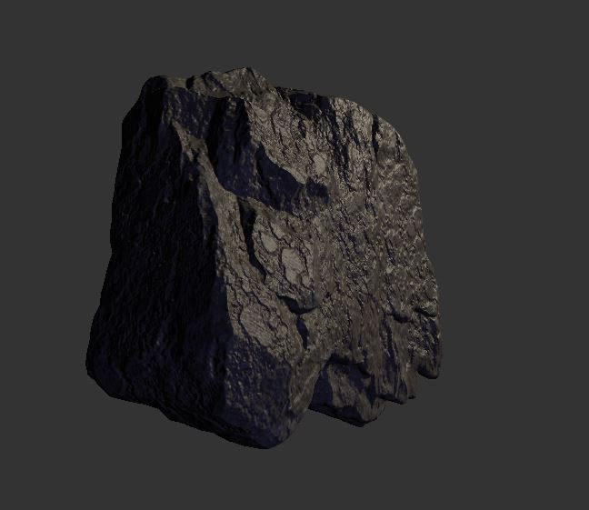

# Chirp

## example rendering

## steps

- download [tiny gltf](https://github.com/syoyo/tinygltf) dependencies and place in root
- install require Nuget packages: `nupengl` and `glm`

## shader

the pbr shader is based on [Khronos Group's example](https://github.com/KhronosGroup/glTF-WebGL-PBR/blob/master/shaders/pbr-frag.glsl)